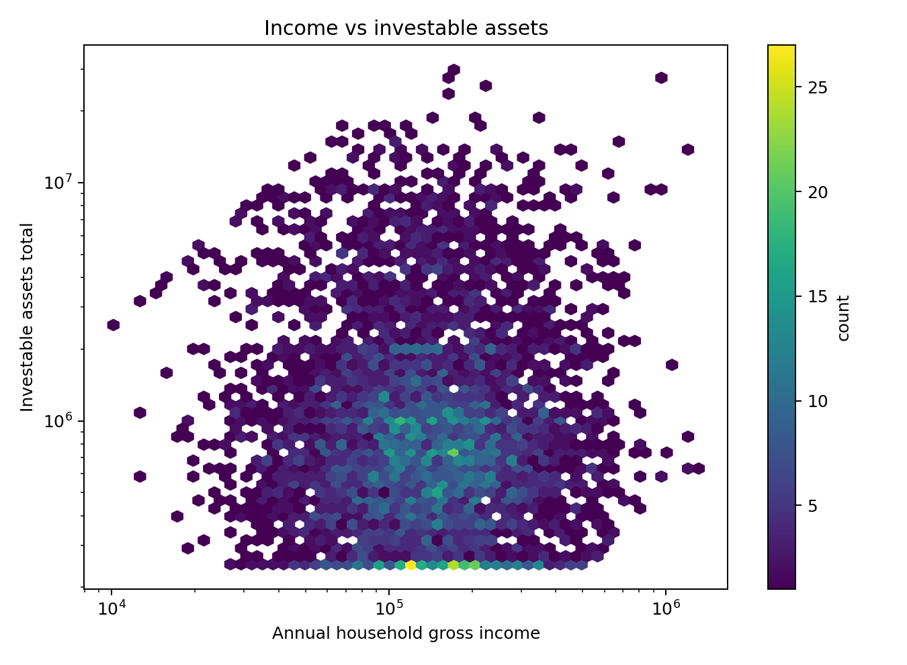

# US RIA-like synthetic household report

## Counts
- households: 5000
- people: 9188
- rule violations: 0

## Medians
- annual household gross income: 136,755.45
- investable assets total: 811,505.17
- net worth proxy: 1,209,483.92
- monthly mortgage payment total (positive only): 2,858.81
- monthly non-mortgage payment total (positive only): 381.25

## Figures

### Income vs assets

## Notes
- Income generation uses a smooth lognormal model anchored to the public median (from open Census ACS where available).
- Amount plots filter out zeros and clip the upper tail for readability.
- Mortgage payment to income ratio is capped at 70%.
- Total debt cost share of income is capped at 95% for plotting.
- Top 5 anomalous households are saved for manual review.
- Sanity: households with income < $100k and investable assets > $10M: 20
